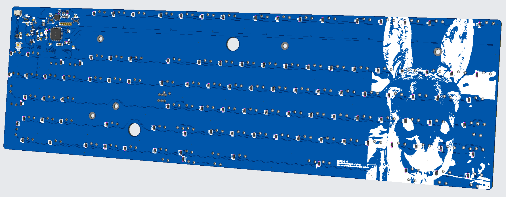

# at101[w]

USB/QMK STM32f411RETx PCB for Dell AT101W and AT101, with WS2812B/APA106 RGB LED, AST1109MLTRQ buzzer support, unified daughterboard output via JST SH 2.0 header, NKRO, etc.

Released without warranty, use at your own risk.  

PRs & feedback welcome!

---

Dimensions: 431.2mm x 128.19mm

---

Originally released under MIT license by BlindAssassin111 and not changed
